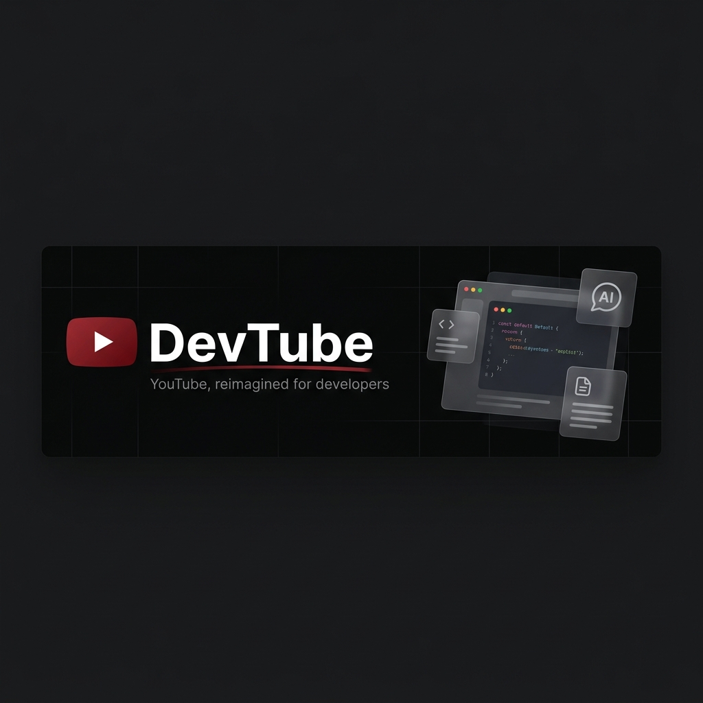
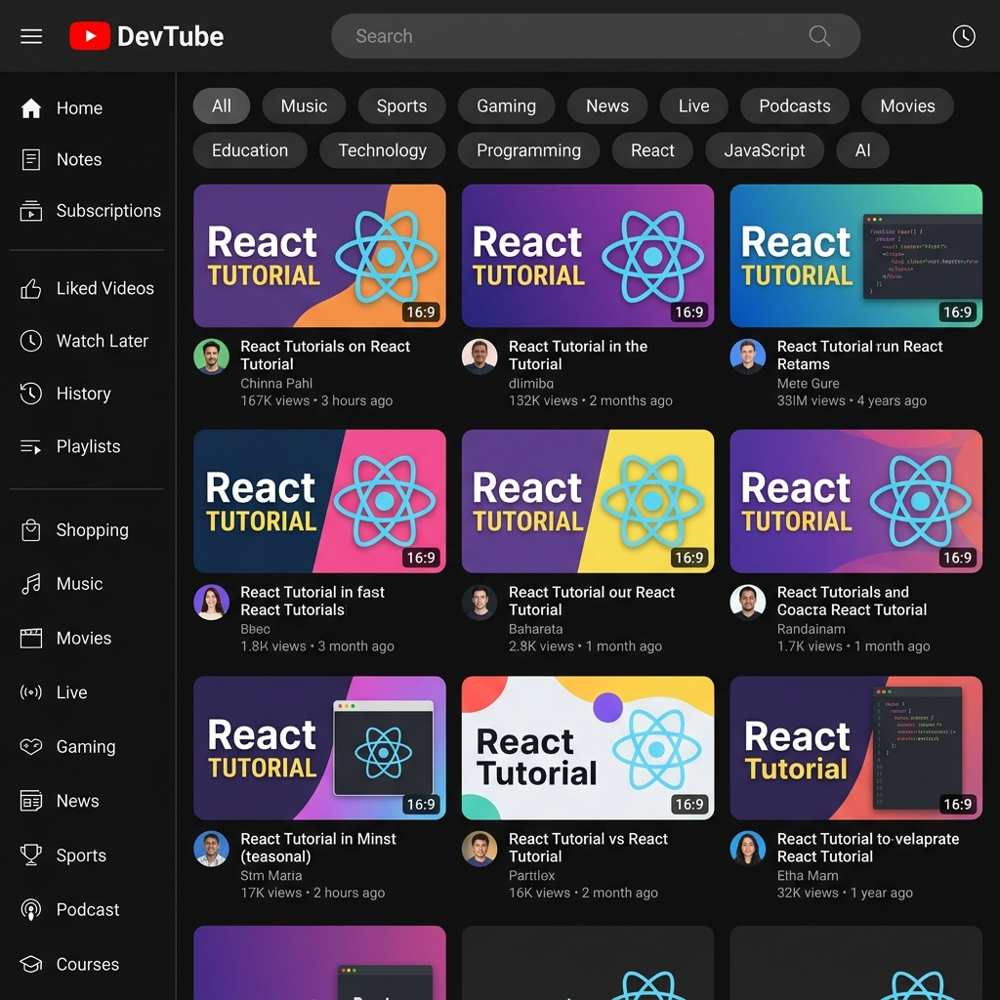
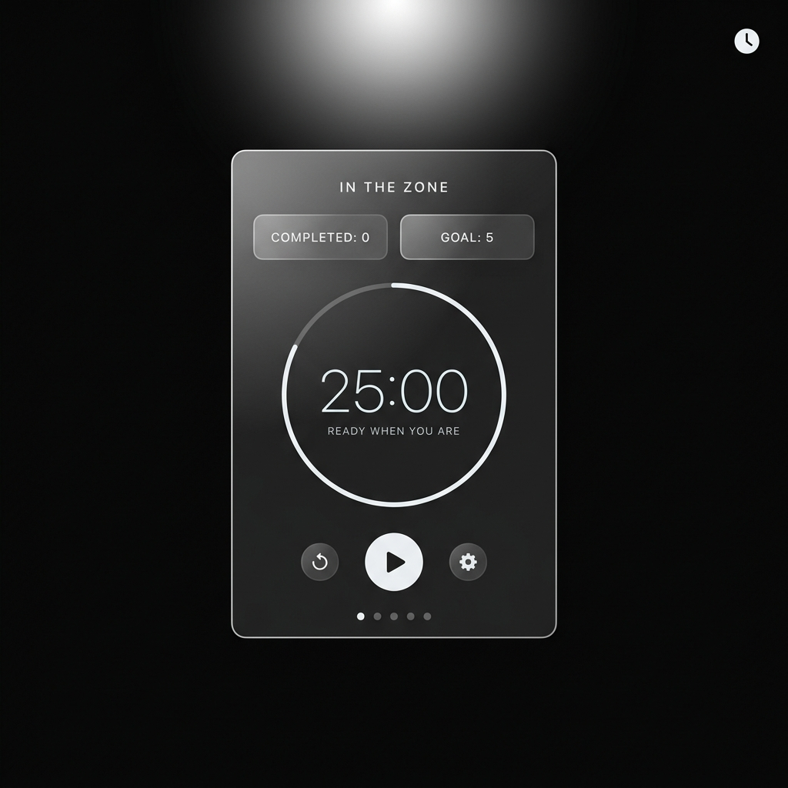
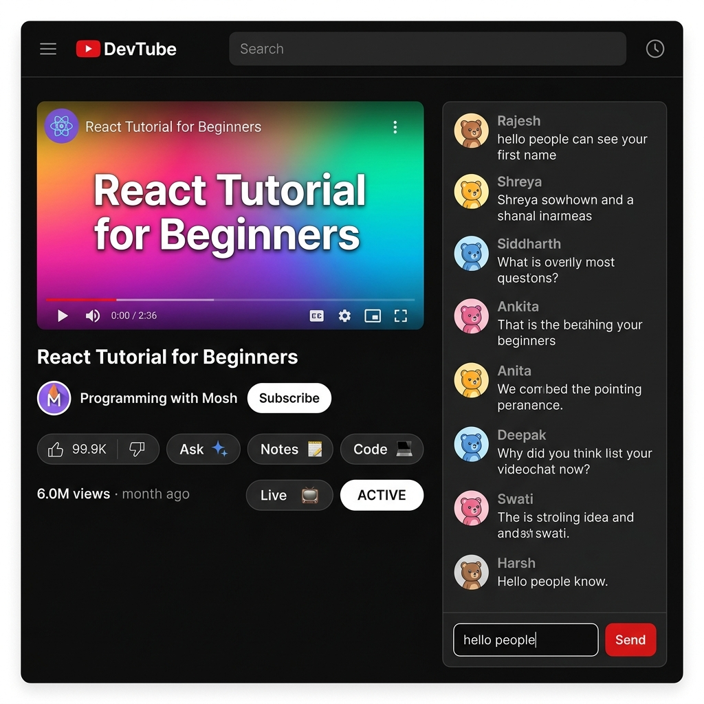
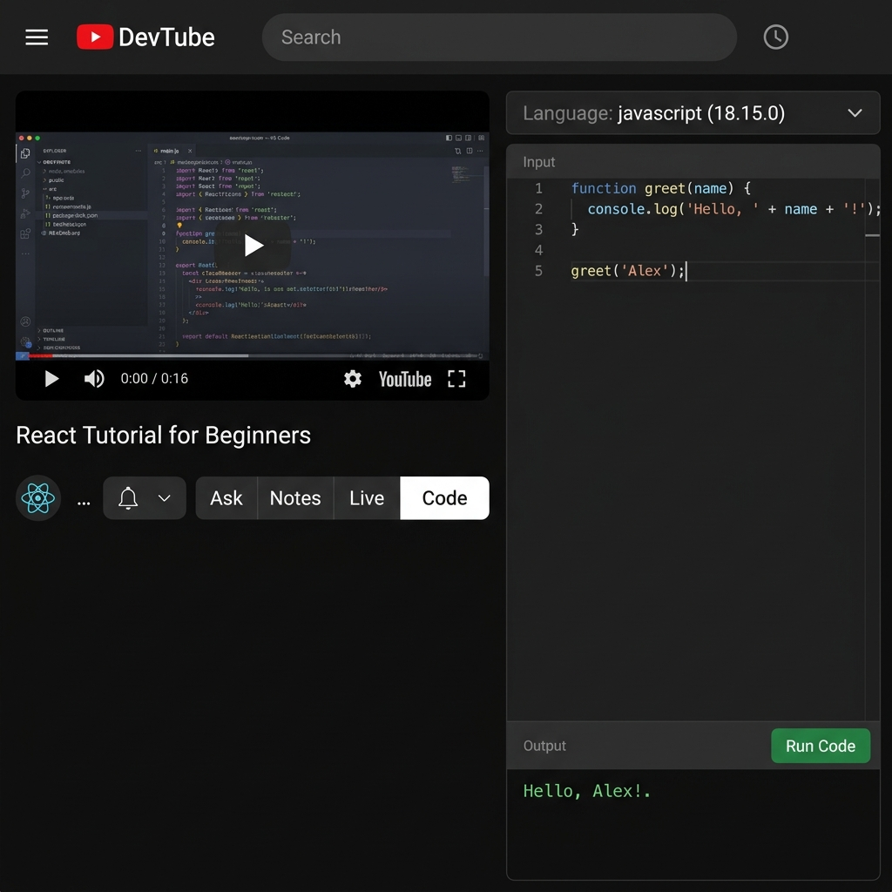
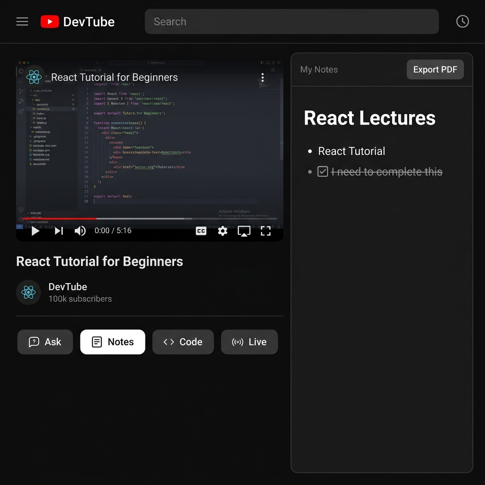

<div align="center">



<br/>

# DevTube 🎬

**YouTube, reimagined for developers.**

Watch videos. Ask an AI. Write code. Take notes. Stay focused — all without leaving the page.

<br/>

[](https://react.dev/)
[](https://vite.dev/)
[](https://redux-toolkit.js.org/)
[](https://tailwindcss.com/)
[](#-license)

</div>

---

## 📸 Screenshots

<table>
  <tr>
    <td align="center" width="50%">
      <strong>🏠 Home Feed</strong><br/>
      
      <sub>Trending videos, infinite scroll, category filter pills</sub>
    </td>
    <td align="center" width="50%">
      <strong>🍅 Focus Mode (Pomodoro)</strong><br/>
      
      <sub>Full-screen timer with SVG ring, session tracking and settings</sub>
    </td>
  </tr>
  <tr>
    <td align="center" width="50%">
      <strong>🗨️ Live Chat Panel</strong><br/>
      
      <sub>Simulated live chat — auto-populated + your own messages</sub>
    </td>
    <td align="center" width="50%">
      <strong>💻 Code Editor Panel</strong><br/>
      
      <sub>Monaco editor (VS Code engine) with AI-powered code execution</sub>
    </td>
  </tr>
  <tr>
    <td align="center" colspan="2">
      <strong>📝 Notes Panel</strong><br/>
      
      <sub>BlockNote rich-text editor, auto-saved to Redux, exportable as PDF</sub>
    </td>
  </tr>
</table>

> **💡 Tip:** All four panels (Live, Ask AI, Notes, Code) are accessible directly from the watch page — no page navigation required.

---

## ✨ Features

### Core YouTube Experience

| Feature | Details |
|---|---|
| 📺 **Trending Feed** | YouTube Data API v3 · region: IN · 25 videos per page |
| ♾️ **Infinite Scroll** | `IntersectionObserver` watches a sentinel div at the bottom and loads the next page via `nextPageToken` |
| 🔍 **Search** | Debounced (200ms) suggestions from Google Suggest API, with in-memory Redux cache to skip repeat network calls |
| 🗂️ **Category Filters** | Horizontal scrollable pill buttons — click to search YouTube by category |
| 🎬 **Watch Page** | Embedded iframe player · channel avatar · like/view counts · expandable description |
| 💬 **Comments** | Recursive nested comment component (tree-structured data) |
| 📌 **Sidebar** | Collapsible via hamburger toggle, persisted in Redux |

---

### 🔥 Developer Productivity Panel

> The feature that makes DevTube different. On the watch page, a **single toggleable side panel** gives you four fully independent tools — without ever leaving your video.

<br/>

| Panel | Icon | What it does |
|---|:---:|---|
| **Live** | 📡 | Simulated live chat — random messages auto-generated every 1.5s via `setInterval`, plus a send-your-own-message input. DiceBear-generated avatars per username. |
| **Ask (AI)** | 🤖 | Groq-powered chat assistant (`llama-3.3-70b-versatile`). Full conversation history maintained. Ask anything about what you're watching. |
| **Notes** | 📝 | BlockNote block-based rich-text editor. Content auto-saved to Redux on every change. Export your notes as a PDF with one click (`jsPDF` + `html2canvas`). |
| **Code** | 💻 | Monaco Editor (the VS Code engine). Language selector for 8 languages with boilerplate snippets. "Run Code" submits to Groq LLM acting as a terminal emulator. |

**Panel toggle logic** — only one panel active at a time; clicking the active tab collapses it:

```jsx
// WatchPage.jsx
const [activePanel, setActivePanel] = useState(null);
// null | "ai" | "notes" | "code" | "live"

const handlePanelToggle = (panelName) =>
  setActivePanel((prev) => (prev === panelName ? null : panelName));
```

```jsx
{activePanel === "code"  && <Code />}
{activePanel === "live"  && <LiveChat />}
{activePanel === "ai"    && <AiChatBot />}
{activePanel === "notes" && <Notes />}
```

Each panel manages its own local/Redux state independently — **switching tabs never loses your progress**.

---

### 🍅 Focus Mode — Pomodoro Timer

A full-screen minimalist productivity timer at `/focus`.

- 🔵 **Circular SVG progress ring** — smooth `stroke-dashoffset` animation
- ⚙️ **Configurable session length** — 25 / 30 / 45 / 50 / 60 min
- 🎯 **Daily goal tracking** — dot indicators per completed session
- 🔔 **Audio alert** on session completion
- ⌨️ **Keyboard shortcut** — `Escape` returns to home
- 🕐 **Clock icon** in the header navigates to/from focus mode from anywhere

---

## 🏗️ Architecture

### Routing (`App.jsx`)

```
/          →  MainContainer   (video feed)
/watch     →  WatchPage       (player + side panel)
/focus     →  Pomodoro        (full-screen timer)
```

`Header` persists across all routes.
`Body` (sidebar + `<Outlet />`) wraps the feed routes.

---

### State Management — Redux Toolkit

Five slices power the entire app:

| Slice | State | Key Actions |
|---|---|---|
| `appSlice` | `isMenuOpen` | `toggleMenu`, `closeMenu` |
| `searchSlice` | `cache: {}` | `addCache` — O(1) lookup by query string |
| `videosSlice` | `items[]`, `nextPageToken`, `isFetching` | `appendVideos`, `setFetching`, `searchVideos` |
| `chatSlice` | `messages[]` (capped at 50) | `addMessage` — newest first (`unshift`) |
| `notesSlice` | `content[]` — BlockNote JSON | `saveNotes` |

### Search Debouncing + Caching

```
User types → keystroke fires → old timer cleared → new 200ms timer set
                                                          ↓
                                            Timer fires after pause
                                                          ↓
                                   Check Redux cache for this query
                                       ↙                    ↘
                               Cache hit                Cache miss
                            (set suggestions         (API call → store
                            from Redux, 0ms)          in cache → set)
```

### Infinite Scroll

```jsx
// VideoContainer.jsx
const observer = new IntersectionObserver((entries) => {
  if (entries[0].isIntersecting && nextPageToken) {
    getVideos(nextPageToken); // load next page
  }
});
observer.observe(bottomRef.current); // invisible sentinel div
```

---

## 🧠 How "Run Code" Works

There is no real sandboxed runtime. The submitted code + language is sent to Groq's LLM with a strict system prompt:

```
You are a code executor. Run the given code mentally and return ONLY the
exact terminal output. No explanation. No markdown. No code blocks.
Just raw output exactly as a terminal would print it.
```

This is a pragmatic workaround after running into reliability, CORS, and quota issues with real execution APIs. Commented-out alternatives (Piston API, online-compiler.io) are preserved in `src/components/CodeFeatures/api.jsx` for reference.

> ⚠️ **Limitation:** Output is LLM-simulated. Results may not be byte-perfect for runtime errors, side effects, or non-deterministic programs.

---

## 🧩 Tech Stack

| Layer | Technology |
|---|---|
| **Build Tool** | [Vite 8](https://vite.dev/) |
| **UI Framework** | [React 19](https://react.dev/) |
| **Styling** | [Tailwind CSS v4](https://tailwindcss.com/) |
| **Routing** | [React Router DOM v7](https://reactrouter.com/) |
| **State** | [Redux Toolkit v2](https://redux-toolkit.js.org/) + React-Redux |
| **Code Editor** | [`@monaco-editor/react`](https://github.com/suren-atoyan/monaco-react) |
| **Notes Editor** | [`@blocknote/react`](https://www.blocknote.dev/) + `@blocknote/mantine` |
| **PDF Export** | [`jsPDF`](https://github.com/parallax/jsPDF) + [`html2canvas`](https://html2canvas.hertzen.com/) |
| **Icons** | [`react-icons`](https://react-icons.github.io/react-icons/) + [`lucide-react`](https://lucide.dev/) |

### External APIs

| API | Used For |
|---|---|
| **YouTube Data API v3** | Video feed, search, channel info |
| **Google Suggest API** | Search autocomplete (proxied via Vite) |
| **Groq — `llama-3.3-70b-versatile`** | AI chat assistant |
| **Groq — `llama-3.1-8b-instant`** | Simulated code execution |
| **DiceBear API** | Avatar generation for live chat usernames |

---

## 📁 Project Structure

```
DevTube/
├── assets/
│   └── screenshots/              # README screenshots
├── api/
│   └── suggestions.js            # Serverless handler — Google autocomplete proxy
├── src/
│   ├── App.jsx                   # Router setup + Redux Provider
│   ├── main.jsx                  # React root
│   ├── index.css                 # Tailwind import + scrollbar-hide utility
│   ├── assets/                   # Logo, avatar PNGs
│   ├── components/
│   │   ├── Header.jsx            # Search bar, debounce + cache, sidebar toggle
│   │   ├── Body.jsx              # Sidebar + <Outlet /> layout
│   │   ├── SideBar.jsx           # Collapsible left nav
│   │   ├── MainContainer.jsx     # ButtonList + VideoContainer wrapper
│   │   ├── ButtonList.jsx        # Category pill list
│   │   ├── Button.jsx            # Single pill → triggers YouTube search
│   │   ├── VideoContainer.jsx    # Infinite-scroll video grid
│   │   ├── VideoCard.jsx         # Thumbnail + channel info card
│   │   ├── WatchPage.jsx         # Player + panel toggle logic (the core!)
│   │   ├── CommentsContainer.jsx # Recursive nested comments
│   │   ├── LiveChat.jsx          # Simulated live chat + send message
│   │   ├── AiChatBot.jsx         # Groq AI chat assistant
│   │   ├── ChatMessage.jsx       # Single chat row with DiceBear avatar
│   │   ├── Notes.jsx             # BlockNote editor + PDF export
│   │   ├── CodeFeatures/
│   │   │   ├── Code.jsx          # Monaco editor shell + layout
│   │   │   ├── LanguageSelector.jsx  # Custom dropdown — 8 languages
│   │   │   ├── Output.jsx        # Run button + output display pane
│   │   │   └── api.jsx           # Groq-based "code execution"
│   │   ├── Pomodoro/
│   │   │   └── Pomodoro.jsx      # Full-screen focus timer
│   │   └── Shimmer/
│   │       ├── ShimmerContainer.jsx
│   │       └── ShimmerVideoCard.jsx
│   └── utils/
│       ├── store.jsx             # Redux store (5 slices)
│       ├── appSlice.jsx          # Sidebar state
│       ├── searchSlice.jsx       # Search suggestion cache
│       ├── videosSlice.jsx       # Video list + pagination
│       ├── chatSlice.jsx         # Live chat messages
│       ├── notesSlice.jsx        # Notes document persistence
│       ├── constants.jsx         # API URLs, language versions, code snippets
│       └── helper.jsx            # Fake name + message generators (live chat)
├── index.html
├── vite.config.js                # Vite + Tailwind plugin + suggestion proxy
└── package.json
```

---

## 🚀 Getting Started

### 1. Clone & Install

```bash
git clone https://github.com/your-username/DevTube.git
cd DevTube
npm install
```

### 2. Environment Variables

Create a `.env` file in the project root:

```env
VITE_GOOGLE_API_KEY=your_youtube_data_api_v3_key
VITE_GROQ_API_KEY=your_groq_api_key
```

<details>
<summary><strong>How to get these keys</strong></summary>

**YouTube Data API v3 key:**
1. Go to [Google Cloud Console](https://console.cloud.google.com/)
2. Create a project (or select existing)
3. Navigate to **APIs & Services → Library**
4. Search for **"YouTube Data API v3"** and enable it
5. Go to **APIs & Services → Credentials → Create Credentials → API Key**
6. (Optional) Restrict the key to `YouTube Data API v3` and your domain

**Groq API key:**
1. Sign up at [console.groq.com](https://console.groq.com/)
2. Navigate to **API Keys → Create API Key**
3. Copy and paste into your `.env`

</details>

### 3. Run the Dev Server

```bash
npm run dev
```

Open [http://localhost:5173](http://localhost:5173) in your browser.

### 4. Build for Production

```bash
npm run build
npm run preview
```

### 5. Lint

```bash
npm run lint
```

---

## ⚠️ Known Limitations

| Limitation | Detail |
|---|---|
| 🤖 **Simulated code execution** | LLM-based, not a real sandbox — don't rely on it for correctness-critical testing |
| 💬 **Fake live chat** | Messages are randomly generated client-side, not from real viewers |
| 🔑 **Client-side API keys** | `VITE_*` keys are bundled and exposed — fine for demo/portfolio, not for production with real quotas |
| 💾 **No persistence** | Notes, chat, and video state live in Redux memory and reset on page refresh |
| 👤 **No auth** | No user accounts, no personal playlists or liked videos |
| 📺 **Hardcoded comments** | YouTube Comments API not yet integrated — `CommentsContainer` renders static demo data |

---

## 🗺️ Roadmap

- [ ] 🏃 Real sandboxed code execution (Judge0 or Piston)
- [ ] 💾 Persist notes to `localStorage` or a backend
- [ ] 🔐 Firebase / Supabase user authentication
- [ ] ⚡ Real-time chat via WebSockets (replacing simulated polling)
- [ ] 🌊 Streaming AI responses (SSE instead of single-shot completions)
- [ ] 💬 Real YouTube Comments API integration
- [ ] 📱 Mobile-responsive layout improvements
- [ ] 🔔 Browser notifications on Pomodoro session complete

---

## 📄 License

This project is for **educational and portfolio purposes only**.

- YouTube functionality is powered by the YouTube Data API and subject to [YouTube's Terms of Service](https://www.youtube.com/t/terms).
- AI features use the Groq API and are subject to [Groq's Terms of Service](https://groq.com/terms-of-use/).

---

<div align="center">

**Built with ❤️ by [Bikash Jha](https://github.com/bikash-jha25)**

*If you found this useful, leave a ⭐ — it keeps the dopamine flowing.*

</div>
